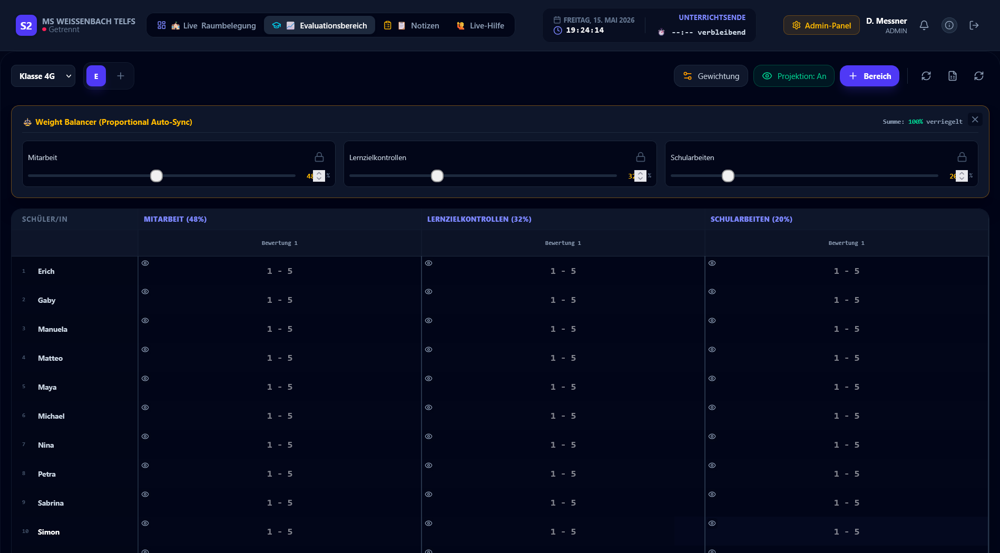
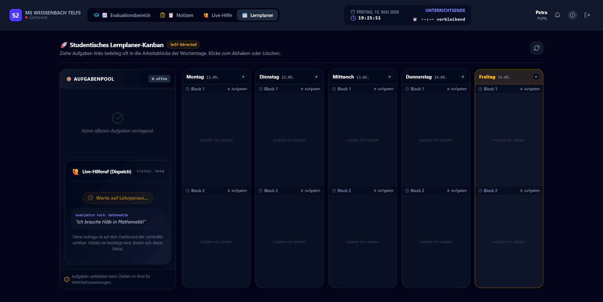

# 🏫 Antigravity V3.0 — Die ultimative Plattform für moderne Schulen 🚀

Willkommen bei **Antigravity**, der hochmodernen, reaktionsschnellen Plattform für das Schulmanagement und die Echtzeit-Unterrichtssteuerung. Entwickelt für die Anforderungen des 21. Jahrhunderts, bietet Antigravity eine nahtlose Verbindung zwischen Verwaltung, Pädagogik und Gamification.

---

## 🌟 Funktionen im Überblick

### 🏫 Für Schulen & Administratoren
- **🔄 WebUntis Deep Sync**: Vollautomatische Synchronisation von Klassen, Lehrern und Schülern. WebUntis dient als "Source of Truth" – einmal einrichten, den Rest erledigt das System.
- **🏢 Intelligente Raumverwaltung**: Jede Klasse erhält automatisch ihren eigenen digitalen Raum. 1:1 Mapping sorgt für absolute Übersichtlichkeit im Schulalltag.
- **🛡️ Maximale Stabilität**: Optimiert für den Betrieb auf Unraid, Proxmox oder lokalen Servern. Integrierte Watchdogs und automatisierte Wartungsfenster garantieren 24/7 Verfügbarkeit.
- **📊 Admin-Analytics**: Detaillierte Berichte über TimeOut-Frequenzen, System-Logs in Echtzeit und automatisierte Sicherheits-Backups.

### 👩‍🏫 Für Lehrpersonen
- **🖱️ Intuitive Raumbelegung**: Verschieben Sie Schüler per Drag-and-Drop in Echtzeit (optimiert für iPad & Touch).
- **📝 Digitales Notenbuch & Notizen**: Erfassen Sie Noten, Mitarbeit und Verhaltensnotizen direkt im Unterricht. Live-Synchronisation mit Co-Lehrern.
- **🙋 Live-Hilfe-System**: Sehen Sie sofort, welcher Schüler Hilfe benötigt. Farblich kodierte Fächer und blinkende Status-Icons sorgen dafür, dass kein Hilferuf übersehen wird.
- **🏆 Gamification-Control**: Vergeben Sie Badges und Level-Ups in 10 verschiedenen Kategorien, um die Motivation Ihrer Schüler zu steigern.

### 📊 Evaluationsbereich (NEU v3.1)
- **20 Pädagogische Insights**: Das Insights-Cockpit im Notenbuch liefert 20 direkt verwertbare pädagogische Kennzahlen pro Fach und Klasse — von Klassen-Ø über Notenverteilung bis hin zur Erfassungsquote und Standardabweichung.
- **Strukturierte Notenmatrix**: Die Notenmatrix ist in 4 Berichtszeiträume aufgeteilt:
  - 📋 **1. Elternsprechtag** — Erste Rückmeldung an Eltern
  - 📄 **Semesternachricht** — Halbjahreszeugnisdaten
  - 📋 **2. Elternsprechtag** — Zweite Rückmeldung
  - 🏆 **Jahreszeugnis** — Abschlussbewertung
- Bewertungen können direkt im Bearbeitungs-Dialog einem Berichtszeitraum zugeordnet werden.

### 🎓 Für Schülerinnen & Schüler
- **📅 Innovativer Lernplaner**: Planen Sie Ihre Lernslots eigenständig und behalten Sie Ihre Ziele im Blick.
- **🚀 Karriere-Dashboard**: Verfolgen Sie Ihren Fortschritt in Echtzeit. Sehen Sie Ihre Badges, Level und "Success Stories" in einem motivierenden Dashboard.
- **💎 Belohnungssystem**: Sammeln Sie Badges für Mitarbeit, Pünktlichkeit und soziale Kompetenz. Steigen Sie im Level auf und werden Sie zum "Meister".
- **📲 Mobile First**: Volle Funktionalität auf dem iPad – dein digitaler Begleiter für jeden Schultag.

### 📈 Karriere-Dashboard Insights (NEU v3.1)
Das Karriere-Dashboard verfügt nun über ein **Pädagogisches Insights-Cockpit** mit 20 schulweiten Kennzahlen auf einen Blick:
- Schulweiter Notenschnitt, beste/schlechteste Klasse
- Top-Schüler, Rising Stars, Engagement-Leaders
- Klassen im Exzellenzbereich vs. kritischem Bereich
- Schüler mit Förderantrag, Achievements-Übersicht, Systemstatus

---

## 📸 Visuelle Eindrücke

| Login & Authentifizierung | Live Raumbelegung |
| :---: | :---: |
|  |  |

| Evaluationsbereich | Lernplaner & Hilfe |
| :---: | :---: |
|  |  |

---

## 🔑 Erster Zugriff

Nach der Installation können Sie sich mit folgenden Standard-Daten anmelden:
- **Benutzername**: `da.messner`
- **Passwort**: `weissenbach`
- *Hinweis: Sie werden beim ersten Login aufgefordert, Ihr Passwort zu ändern.*

---

## 🚀 Quickstart & Deployment (Windows)

### Automatische Installation (Ein-Klick)
Öffnen Sie die PowerShell und kopieren Sie diesen Befehl:

```powershell
irm https://raw.githubusercontent.com/damessner/antigravity/main/scripts/setup_new_installation.ps1 | iex
```

### Manuelle Installation
Starten Sie die nummerierten Batch-Dateien in der richtigen Reihenfolge:
1. **`01_initiate_system.bat`**: Systemcheck & Vorbereitung.
2. **`02_launch_system.bat`**: Startet die gesamte Plattform.

---

## 🖥️ Proxmox / LXC Deployment

### Erstinstallation (vom Proxmox-Host)
```bash
bash -c "$(curl -fsSL https://raw.githubusercontent.com/damessner/antigravity/main/scripts/proxmox_install.sh)"
```

Nach einer frischen Proxmox-/LXC-Installation reicht für den Browser-Zugriff der **Frontend-Port 3000**. Die Weboberfläche leitet Login- und API-Aufrufe nun standardmäßig intern an den Backend-Container weiter, damit kein direkter Browser-Zugriff auf Port 4000 mehr nötig ist und der Fehler **"NetworkError when attempting to fetch resource."** beim ersten Login nicht mehr auftritt.

**Wichtig bei bestehenden Installationen:** Nach einem Update die Container **neu bauen**, damit der Frontend-Proxy mit der aktuellen Backend-Zieladresse erzeugt wird:

```bash
cd /opt/antigravity
docker compose build --no-cache frontend
docker compose up -d frontend
```

### System-Update (direkt im LXC-Container)
Wenn Sie sich bereits im LXC-Container befinden, können Sie das System mit diesem einzelnen Befehl aktualisieren:

```bash
curl -fsSL https://raw.githubusercontent.com/damessner/antigravity/main/scripts/update_system.sh | bash
```

Dieser Befehl pulled die neuesten Änderungen von GitHub, führt ggf. Schema-Migrationen durch und startet alle Container neu.

---

## 🛠️ Management & Wartung

- **`00_initiate_system.bat`**: Überprüft Docker und Datei-Integrität.
- **`01_update_system.bat`**: Prüft auf GitHub-Updates und installiert diese automatisch.
- **`02_launch_system.bat`**: Das Hauptwerkzeug für den täglichen Start/Stopp.
- **`03_clean_slate.bat`**: Setzt das System zurück (inkl. Sicherheits-Backup).
- **`04_system_health_monitor.bat`**: Live-Logs und Ressourcenverbrauch (CPU/RAM).

---

## 🌌 Technical Architecture & Enterprise Specifications

Antigravity is engineered as a high-availability, containerized microservices ecosystem, specifically designed for low-latency educational environments.

### 🏗️ Core Infrastructure Stack
- **Frontend Framework**: **Next.js 15 (React 19)** utilizing App Router for optimized server-side rendering and client-side hydration. Built with **TypeScript** for absolute type safety.
- **Real-Time Engine**: **Socket.io (WebSockets)** orchestration for sub-100ms latency in student movement and live help broadcasting.
- **Backend Services**: **Node.js / Express.js** high-throughput API layer with JWT-based stateful authentication and rate-limiting protection.
- **Data Persistence**: **PostgreSQL 15 (Alpine)** relational database engine with advanced indexing for complex ranking queries and automated schema migration handling.

### ⚙️ Enterprise Integration Layer
- **WebUntis JSON-RPC Integration**: A sophisticated read-only synchronization engine that maps external educational structures into local relational entities with 1:1 room/class parity.
- **Automated Lifecycle Management**: Integrated health-check watchdogs and container-level restart policies (`unless-stopped`) ensure operational continuity on Unraid/Proxmox environments.
- **Asynchronous Processing**: Background job scheduling for automated system backups, log rotation, and maintenance windows.

### 🔒 Security & Performance
- **Network-Agnostic Networking**: Dynamic API discovery logic allows the system to resolve its own environment (LAN, VLAN, or WAN) without manual configuration.
- **Encrypted Communication**: Support for SSL termination and secure JWT payloads for cross-service communication.
- **Rolling Log Architecture**: A 72-hour rolling logging system with automated trimming to preserve storage integrity on constrained hardware.

---
© 2026 Antigravity System — Built for the future of education. 🇦🇹
